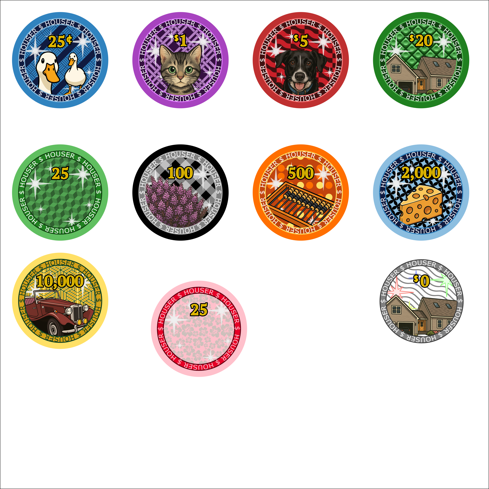

# Custom Personal Poker Chips

Design for custom poker chips. To be ordered from [BR Pro Poker](https://brpropoker.com/collections/custom-chips/products/copy-of-custom-39mm-1-5-inch-chips-standard-casino-chip-size).

Current Design (as of 2025/07/13):

# Custom Poker Chips

2025-07-17 Revised Design colors and counts

| **label** | **color**  | **icon** |     |  CASH | **stack** | **# chips** |     |        T25 |  stack   | # chips | **order** | traditional color |
| --------: | ---------- | -------- | --- | ----: | :-------: | ----------: | --- | ---------: | :------: | ------: | --------: | ----------------- |
|      25 ¢ | blue (25¢) | cheese   |     | $   1 |   4x20    |          80 |     |            |          |         |       100 |                   |
|       $ 1 | purple     | tabby    |     |  $ 14 |   14x20   |         280 |     |            |          |         |       300 | white             |
|       $ 5 | red        | maxine   |     | $   5 |   1x20    |          20 |     |            |          |         |       150 |                   |
|      $ 20 | green      | roadster |     |       |           |             |     |            |          |         |       100 |                   |
|        25 | pink       |          |     |       |           |             |     | $      200 |   8x20   |     160 |       200 |                   |
|       100 | black      | heather  |     |       |           |             |     | $      800 |   8x20   |     160 |       200 |                   |
|       500 | aqua/cyan  |          |     |       |           |             |     |  $   3,000 |   6x20   |     120 |       150 | purple            |
|     2,000 | yellow     |          |     |       |           |             |     |  $   6,000 |   3x20   |      60 |       100 |                   |
|    10,000 | orange     | abacus   |     |       |           |             |     |   $ 10,000 |   1x20   |      20 |        50 |                   |
|       $ 0 | white      | house    |     |       |           |             |     |            |          |         |        50 |                   |
|    bounty | brown      |          |     |       |           |             |     |            |          |         |        25 |                   |
|           |            |          |     |  $ 20 | 19 chips  |         380 |     |   $ 20,000 | 26 chips |     520 |      1425 |                   |

Cash Game: $0.25/$0.25 blinds, $20 buy-in: 4x$0.25, 14x$1, 1x5 (19 chips each buy-in)
Tournament: $0.25/$0.25 blinds, $20 buy-in: $0.25x8, $1x8, $5x6, $20x3, $100x1 (26 chips each buy-in)

Early 2025 Estimates and Design Colors

| cash value | color  | label  | cash game need  | tournament need | to order |
| ---------- | ------ | ------ | --------------- | --------------- | -------- |
| 0.01       | white  | 1      |                 |                 | 100      |
| 0.05       | purple | 5      |                 |                 | 100      |
| 0.25       | blue   | 25     | 4x20  80 chips  | 8x20 160        | 200      |
| 1.00       | red    | 100    | 14x20 280 chips | 8x20 160        | 300 *    |
| 5.00       | green  | 500    | 1x20  20        | 6x20 120        | 150      |
| 20.00      | black  | 2,000  |                 | 3x20 60         | 100      |
| 100.00     | orange | 10,000 |                 | 1x20 20         | 50       |

Custom Poker Chips:
https://brpropoker.com/collections/custom-chips/products/copy-of-custom-39mm-1-5-inch-chips-standard-casino-chip-size

Tiki chips with custom denomination:
https://brpropoker.com/collections/tiki-kings

1,000 Chip set
https://www.pokerchipforum.com/threads/1000-chip-set-breakdown.99018/

$1 x 200, $5x250, $25x200, $100x150, $500x100, $1000x100

"Most popular 2 table breakdown"
$25x 160, $100x 160, $500x 80, $1000x140, $5000x 60

If starting with a 1 denom chip (T1), a tournament set probably only needs T5, T25, T100 and T500 chips to run a tournament.
If the lowest denom is T25 chip, a set generally needs only T25 through T5000.

